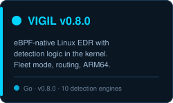
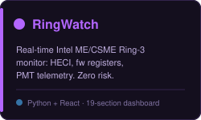
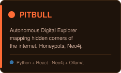

# Hi, I'm Dan Vladoiu 👋

Independent Security Researcher & Builder — Privacy-first defensive tooling for Linux.

## What I build

|  |  |  |
| :-: | :-: | :-: |

### [VIGIL](https://github.com/infinit3l00p/vigil) — eBPF-native EDR (v0.8.0) 🔵
Endpoint Detection and Response with detection logic living in the kernel. Cross-view integrity (kernel vs `/proc`), temporal anomaly detection, self-integrity — built to resist the EvilEDR attack class. v0.8 adds multi-host fleet mode, alert routing (webhook/Slack/Discord/Telegram/email), and ARM64 support. Ships with a rootkit simulator so every claim is reproducible.

### [RingWatch](https://github.com/infinit3l00p/ringwatch) — Real-time Ring -3 Monitor 🟣
Live Intel ME/CSME activity monitoring — HECI bus probing, firmware registers, MEI client tracking, and PMT telemetry, correlated with sysfs, dmesg, lsof, and network state. Read-only, zero risk: no system modifications. A 19-section dashboard with live charts for power consumption, MEI memory, and timestorm detection. One of the few public Ring-3 monitors in existence.

### [PITBULL](https://github.com/infinit3l00p/pitbull) — Autonomous Digital Explorer 🔱 🟠
Autonomous Benevolent Yielding & Forensic Intelligence System — a digital explorer with personality, reasoning, and self-evolution that maps hidden, forgotten, and invisible corners of the internet. Honeypots and deception layers, Suricata IDS integration, a Neo4j-backed knowledge graph for memory, local-LLM reasoning (Ollama), a Cytoscape.js threat map, and a RAM Zero memory-hygiene module.

## Focus areas

- eBPF-based kernel detection & integrity
- Intel ME / firmware-level security (Ring -3)
- Anti-rootkit techniques (cross-view, temporal, lineage)
- Privacy-first architecture: E2E encryption, minimal attack surface

## Currently building

- **DoseStream** — a medication reminder app with family circles, E2E-encrypted sync, and no data harvesting (launching soon)

---

*MIT for userspace • GPL v2 for kernel eBPF (as the kernel demands)*
